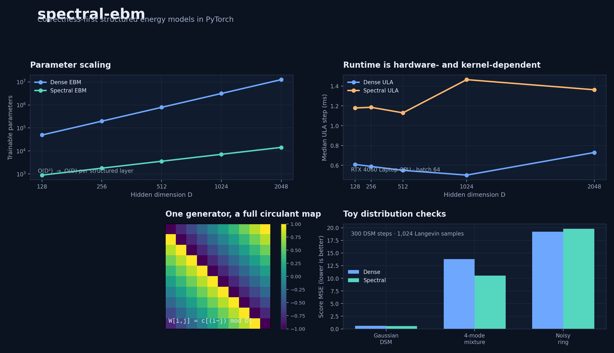
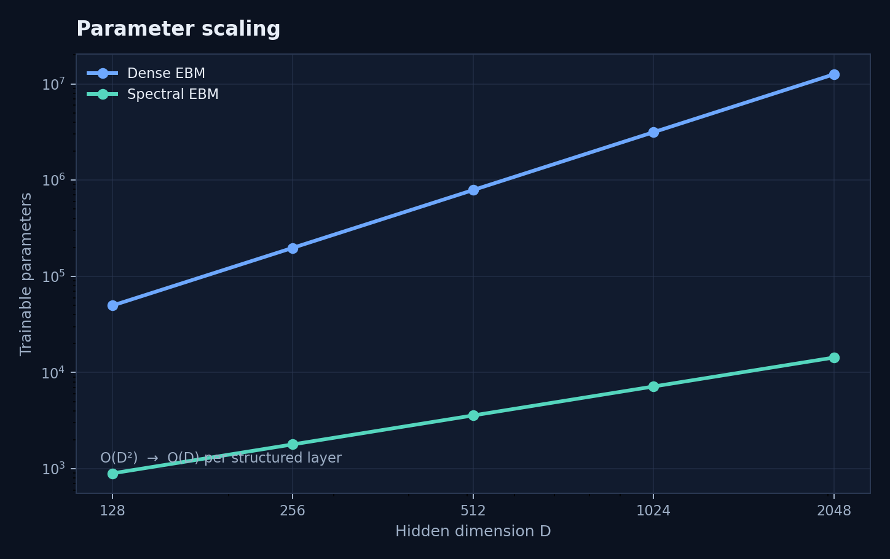
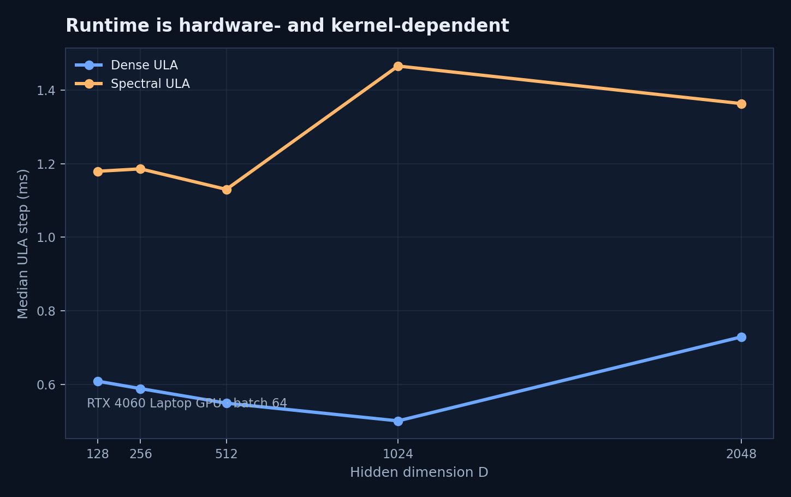
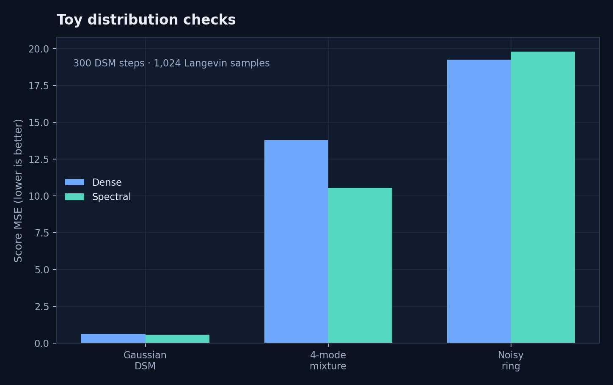

<div align="center">

# spectral-ebm

### Correctness-first structured energy-based models in PyTorch

FFT-parameterized circulant layers, explicit Langevin dynamics, reference-matrix checks, and reproducible benchmark artifacts.

[](https://github.com/j-arndt/spectral-ebm/actions/workflows/ci.yml)
[](https://github.com/j-arndt/spectral-ebm/releases)
[](LICENSE)
[](pyproject.toml)
[](https://pytorch.org/)



</div>

## The idea

A dense hidden layer stores a full `D × D` matrix. A circulant layer stores one generator vector `c ∈ R^D`, applies the corresponding circular convolution with FFTs, and exposes an exact matrix convention that can be checked against a materialized reference.

This repository packages that structure into scalar energy models and tests the entire path: layer algebra, parameter counts, input gradients, Langevin updates, persistent chains, serialization, and small distribution-learning experiments.

> **Scope:** this is a reproducible proof of concept and engineering baseline. It does not claim universal runtime superiority, equal expressivity to dense networks, or a new invention in circulant matrices or EBMs.

## Results at a glance

| Dimension | Dense parameters | Spectral parameters | Reduction |
|---:|---:|---:|---:|
| 128 | 49,664 | 896 | 55.4× |
| 512 | 788,480 | 3,584 | 219.8× |
| 1,024 | 3,149,824 | 7,168 | 439.6× |
| 2,048 | 12,591,104 | 14,336 | **878.8×** |

At `D = 2,048`, the spectral model uses nearly three orders of magnitude fewer trainable parameters. The trade-off is structural restriction and, in the current CUDA snapshot, a slower end-to-end ULA step: `1.363 ms` spectral versus `0.729 ms` dense on an RTX 4060 Laptop GPU. The benchmark makes that trade-off visible instead of hiding it behind asymptotic notation.

<p align="center">
  
  
</p>

### Toy distribution checks

The included score-matching smoke tests are intentionally small and diagnostic, not claims of state-of-the-art modeling quality.

| Experiment | Dense score MSE | Spectral score MSE | Better snapshot |
|---|---:|---:|---|
| Standard Gaussian DSM | 0.603 | **0.553** | Spectral |
| Four-mode Gaussian mixture | 13.777 | **10.519** | Spectral |
| Noisy ring score matching | **19.239** | 19.785 | Dense |



All values above are read directly from the committed JSON artifacts in [`benchmark_results/`](benchmark_results). See the [benchmark protocol](docs/benchmark_protocol.md) for device, batch size, repetitions, and timing conventions.

## Start here

| Goal | Path |
|---|---|
| Understand the math | [Proof and conventions](docs/proof.md) |
| Run the tests | `python -m pytest` |
| Try a minimal model | [Install and example](#install) |
| Reproduce timings | [Benchmark protocol](docs/benchmark_protocol.md) |
| Reproduce toy experiments | [`scripts/`](scripts) and [`benchmark_results/`](benchmark_results) |
| Evaluate novelty claims | [Prior art and novelty boundary](docs/novelty.md) |
| Contribute | [CONTRIBUTING.md](CONTRIBUTING.md) |

## Install

Python 3.10+ and PyTorch 2.1+ are supported.

```powershell
python -m pip install -e .
python -m pip install -r requirements-dev.txt

$env:PYTEST_DISABLE_PLUGIN_AUTOLOAD = "1"
python -m pytest -q
ruff check .
```

## Minimal example

```python
import torch

from spectral_ebm import SpectralEBM, langevin_sample

model = SpectralEBM(dim=32, hidden_layers=3)
initial = torch.randn(16, 32)
samples = langevin_sample(model, initial, steps=100, step_size=0.01)
print(samples.shape)  # torch.Size([16, 32])
```

For persistent chains and training losses, see [`spectral_ebm/chains.py`](spectral_ebm/chains.py) and [`spectral_ebm/training.py`](spectral_ebm/training.py).

## Mathematical contract

The implementation uses one explicit convention throughout:

```text
W[i, j] = c[(i - j) mod D]
W x     = irfft(rfft(x) * rfft(c), n=D)
```

The first column of `W` is `c`. The spectral norm is computed exactly from the maximum magnitude of the discrete Fourier spectrum of `c`. For energy `Eθ(x)` at temperature `T`, the implemented ULA update is:

```text
x_next = x - h/(2T) ∇x Eθ(x) + √h ε
ε ~ Normal(0, I)
```

The reference construction, normalization details, invariants, and limitations are written out in [docs/proof.md](docs/proof.md). Projected bounds are exposed as an explicit approximation; they are not presented as exact unconstrained sampling.

## Reproduce the benchmark suite

```powershell
# Layer and ULA benchmark
python -m benchmarks.benchmark_layers --device cuda --dims 128 256 512 --batch-size 64 --repeats 10 --warmup 5 --output benchmark_results/local-cuda.json

# Larger end-to-end measurements
python -m benchmarks.full_benchmark --device cuda --dims 1024 2048 --batch-size 64 --repeats 10 --output benchmark_results/local-cuda-large.json

# Toy distribution checks
python scripts/train_gaussian_dsm.py --output benchmark_results/local-gaussian.json
python scripts/train_mixture_dsm.py --output benchmark_results/local-mixture.json
python scripts/train_ring_score.py --output benchmark_results/local-ring.json

# Rebuild the committed README figures
python scripts/make_plots.py
```

The committed artifacts include CPU and CUDA timings, large-dimension measurements, parameter counts, score-matching results, and every timing repetition. Results are hardware-specific. The current data supports a strong parameter-efficiency claim, not a universal speed claim.

## Repository map

```text
spectral_ebm/       Core layers, models, chains, samplers, and training losses
benchmarks/         Timing harnesses with synchronized CUDA measurements
scripts/            Toy experiments and reproducible figure generation
tests/              Algebra, gradients, sampling, serialization, and training tests
docs/               Proof, training, benchmark, and novelty documentation
benchmark_results/  Raw JSON artifacts used for the published result plots
```

## Research boundary and prior art

Circulant and FFT-structured projections are established prior art, as are EBMs trained with Langevin-based methods. The project documents that boundary explicitly and avoids describing the basic combination as a new invention. Any future research claim should be narrower than the baseline, compared against the closest references, and supported by a theorem or reproducible experiment. See [docs/novelty.md](docs/novelty.md).

## Releases, license, and citation

The current public release is [v0.1.3](https://github.com/j-arndt/spectral-ebm/releases/tag/v0.1.3). Source code is licensed under the [Apache License 2.0](LICENSE). Citation metadata is provided in [CITATION.cff](CITATION.cff).

```bibtex
@software{arndt_spectral_ebm_2026,
  author  = {Arndt, Justin},
  title   = {spectral-ebm},
  year    = {2026},
  url     = {https://github.com/j-arndt/spectral-ebm},
  license = {Apache-2.0}
}
```

## Status

`v0.1.3` is a polished proof-of-concept release: the local test suite passes, the GitHub Actions matrix passes on Python 3.10 and 3.12, and the public repository contains the raw evidence needed to reproduce the claims.